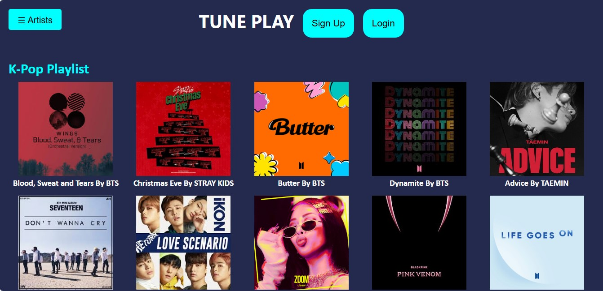
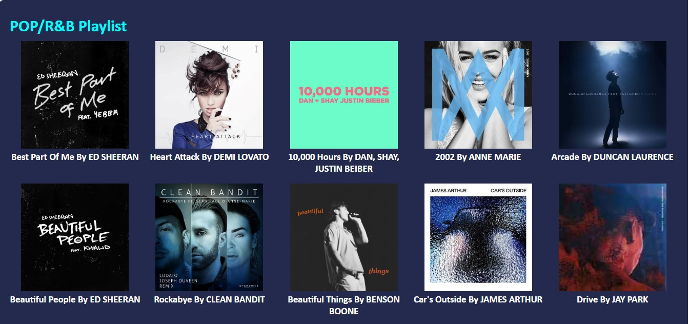
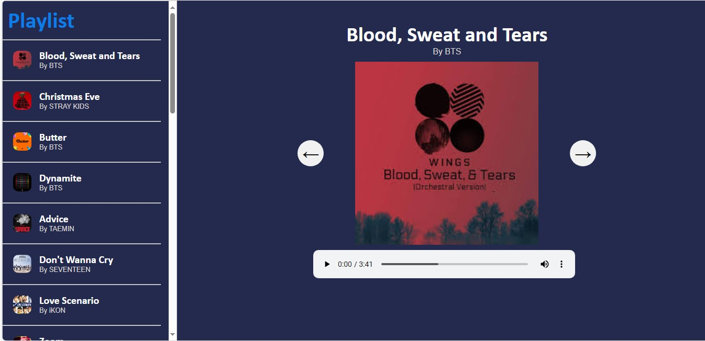
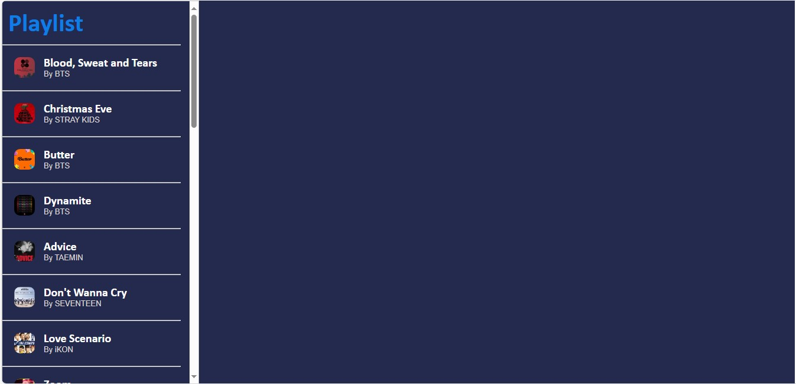
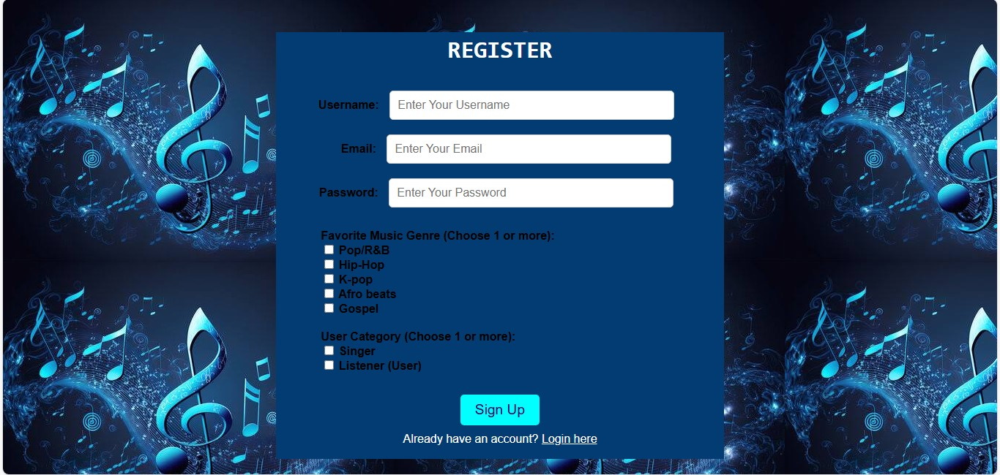
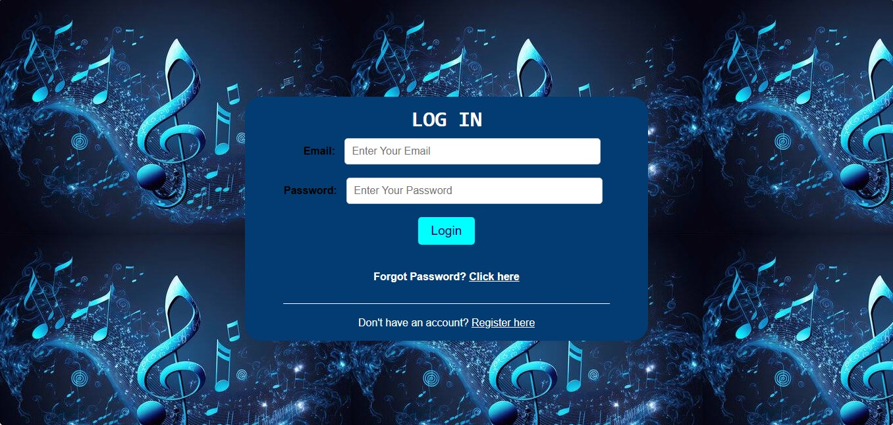
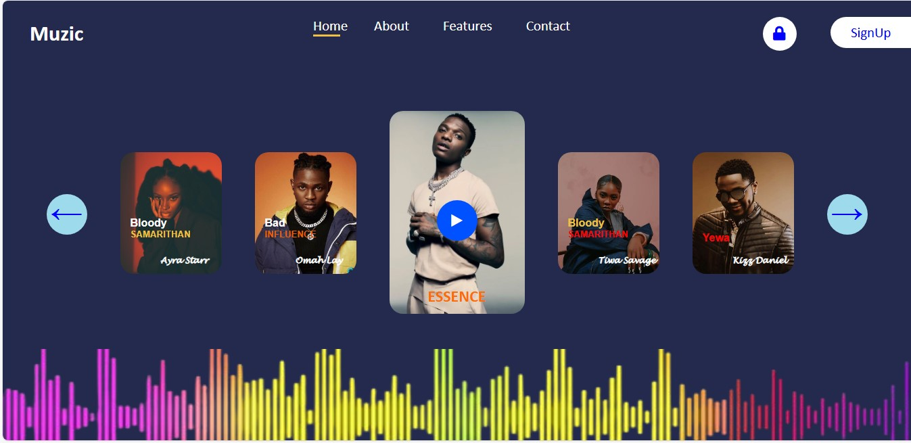

# Music Player Website

# Project Overview

This project is a simple music website with multiple pages where users can browse playlists, explore, view songs, and play music. 

# Features

1. **Playlist:** Displays a list of playlists and songs. Users can click on songs to view and play them.
2. **Music Player Page:** On selecting a song from the playlist, users are taken to a dedicated player page where they can:
- Play the selected song.
- Navigate between previous and next songs using arrows.
- View a full playlist on the same page.
3. **Account:** Users can either register or log in.
4. **Database Integration:** Songs information are stored in a database and retrieved to be displayed on the pages. Users info are stored there.

# Technologies Used

1. **HTML5** for structure
2. **CSS3** for styling
3. **PHP** for server-side logic and database handling
4. **JavaScript** for front-end functionality
5. **MySQL** (via **XAMPP** for the local database)


# Project Structure

- **index.php:** The main page where playlists and songs are displayed.
- **home-page.html:** A static music display page with no functionalities.
- **play-music.php:** The page where the selected song is played, with navigation controls for previous and next songs, and a playlist display.
- **css/:** This folder contains CSS files for styling the various pages in the website.
- **images/:** This folder contains songs and artists pictures.
- **songs/:** This folder contains the music files.
- **sign-up.php:** Registration page.
- **login.php:** Login page.
- **musicWeb.php:** This file contains the necessary PHP functions and also handles database connection.
- **auth.php:** This file contains the codes for authentication like creating database, tables.
- **script.js:** This javaScript file handles various front-end functionalities in the website. 

# Screenshots

1. HomePage
- 

2. Playlist (Homepage)
- 

3. MusicPlayer Page
- 

4. MusicPlayer Page (Playlist)
- 

5. Registration Page
- 

6. Sign-In Page
- 

7. HomePage Display (No functionality) 
- 


# Setup Instructions

1. Clone the repository to your laptop, system or computer by running this: 
```bash
 git clone https://github.com/Temitope1606/Music-Website.git
```
2. Set up the database:
  - Make sure you have XAMPP or WAMP running.
  - Place the cloned repository in the htdocs folder (for XAMPP) or the www folder (for WAMP).
  - Open your browser and run localhost/foldername/auth.php to create the necessary database and tables.
  - Update the database connection settings (like database name and table names) in the auth.php file.
3. Access the website
  - Run this on your browser: localhost/foldername/index.php


# Future Improvements 

- **Adding more music:** Incorporating more tracks and playlists.
- **Advanced Player Controls:** Include volume control, repeat, shuffle, and more detailed song information.
